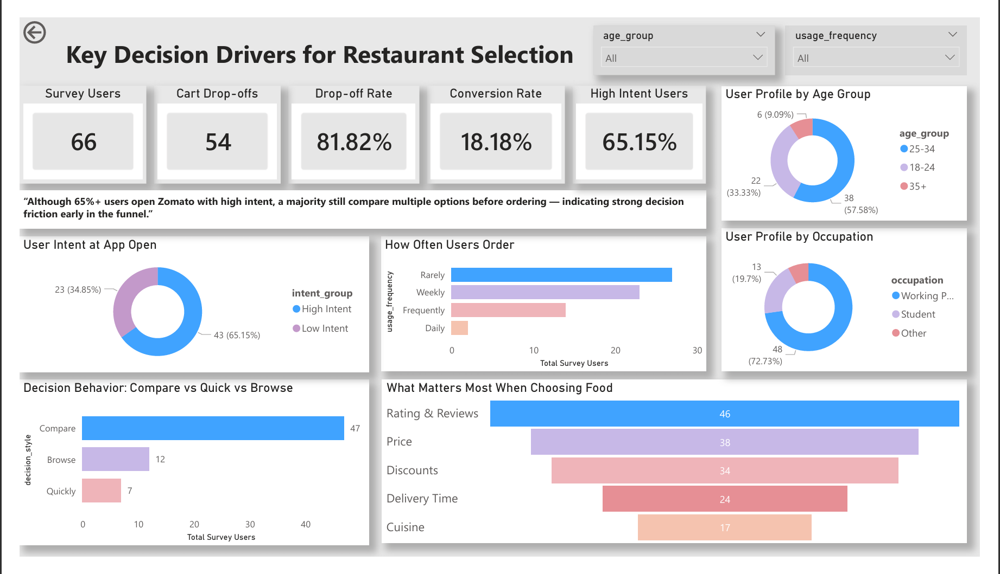
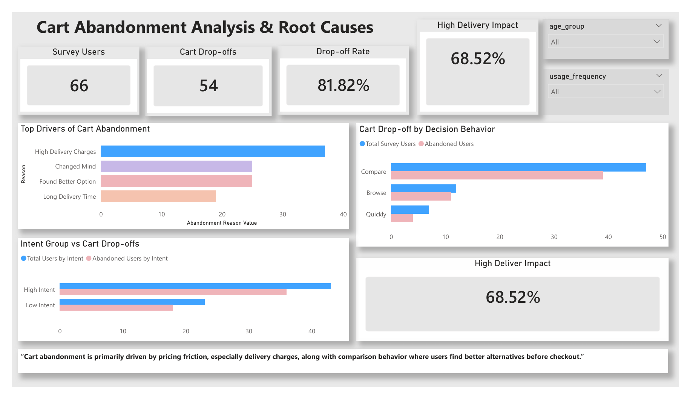
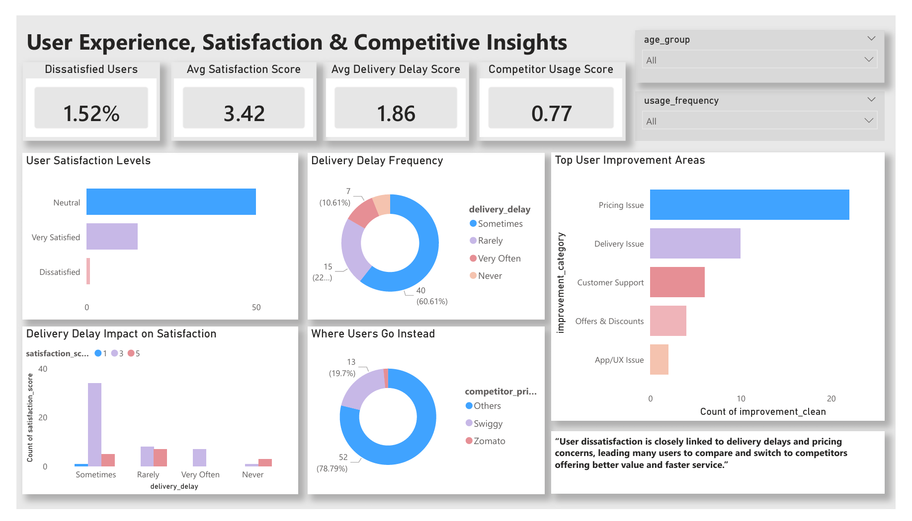
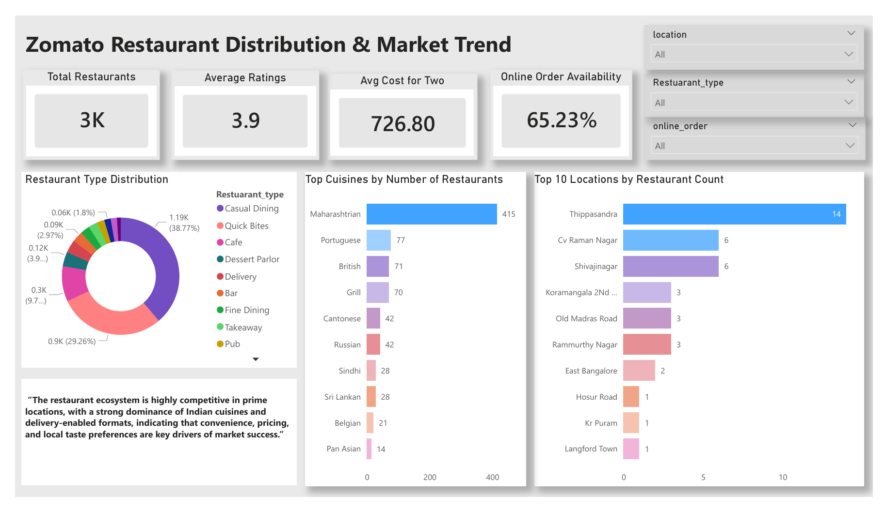
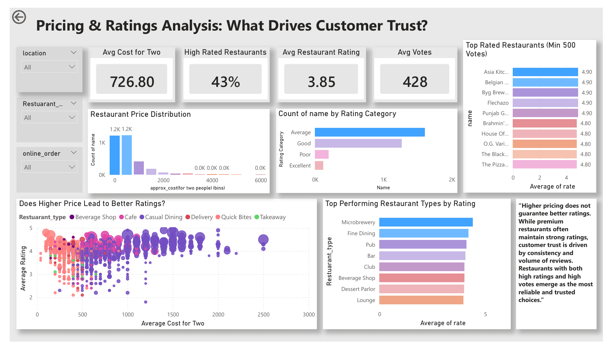
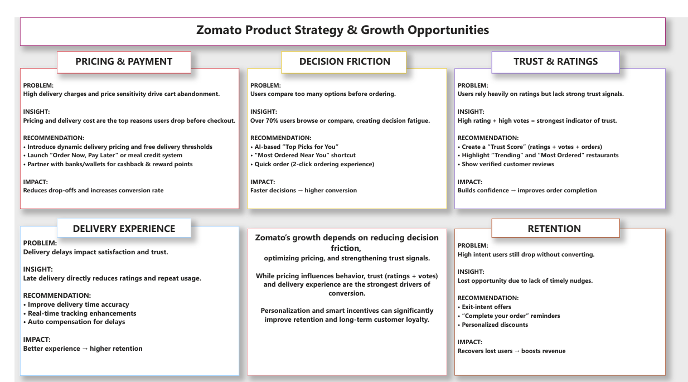

# Zomato Cart Abandonment & Conversion Optimization Case Study

📊 End-to-End Product Analytics Case Study | Power BI • SQL • Primary Research  

Most users don’t open Zomato to browse.  
They open it to order.  

But here’s the problem — a large number of users add items to cart and still don’t complete the order.  

This project started with a simple question:  

**Why do high-intent users drop off before checkout?**

---

## 📌 Project Overview

This is not just a dashboard project.  

It’s a **product + business case study** focused on understanding:

* User decision behavior  
* Pricing sensitivity  
* Cart abandonment patterns  
* Trust signals in restaurant selection  

The goal was to **identify friction in the ordering journey** and suggest product-level improvements to increase conversion.

---

## 📊 Data Sources

* **Primary Survey Data (66 users)**  
  → Designed to understand intent, decision-making, and drop-off reasons  

* **Zomato Restaurant Dataset (Kaggle)**  
  → Used for pricing, ratings, votes, cuisine, and market context  

* **Funnel Observation**  
  → Understanding real user journey from app open → checkout  

---

## 📝 Survey Questionnaire

As part of this project, I conducted primary research to understand real user behavior behind food ordering decisions.

The survey focused on:
- User intent when opening the app  
- Decision-making behavior (compare vs quick order)  
- Cart abandonment reasons  
- Delivery experience and satisfaction  
- Competitor usage patterns  

👉 **View Survey Questionnaire:**  
https://forms.gle/f6A55BqpstAYoX3p7

---

## 🎯 Key Business Questions

* Why do users abandon carts after adding items?  
* Does pricing impact conversion decisions?  
* How does comparison behavior affect drop-offs?  
* What builds trust while choosing a restaurant?  
* Why do users switch to competitors?  

---

## 🔍 Key Insights

### 1. High Intent ≠ High Conversion

Over 65% users open the app with intent to order,  
but conversion drops significantly (~18%).  

👉 The problem is not demand — it’s friction.

---

### 2. Pricing is the Biggest Drop-off Trigger

* High delivery charges are the #1 reason for abandonment  
* Users drop when the **final payable amount feels too high**  

---

### 3. Decision Fatigue Slows Users Down

* Most users compare multiple restaurants before ordering  
* Too many choices → delayed decisions → higher drop-offs  

---

### 4. Trust is More Than Ratings

* High ratings alone don’t build trust  
* **Ratings + Votes (social proof)** drive confidence  

---

### 5. Weak Loyalty = High Switching

* Many users actively use competitors  
* Switching is driven by:

  * Better offers  
  * Faster delivery  
  * Better perceived value  

---

## 📈 Dashboard Overview

* **Page 1 → User Behavior & Intent**  
* **Page 2 → Cart Abandonment Deep Dive**  
* **Page 3 → User Experience & Satisfaction**  
* **Page 4 → Restaurant Market & Distribution**  
* **Page 5 → Pricing & Trust Analysis**  
* **Page 6 → Product Strategy & Recommendations**  

---

## 📊 Dashboard Snapshots

These dashboards translate user behavior into actionable product insights across the ordering journey.

### 1. User Behavior & Intent

### 2. Cart Abandonment Analysis

### 3. User Experience & Satisfaction

### 4. Market & Distribution

### 5. Pricing & Trust Analysis

### 6. Product Strategy & Recommendations

---

## 🧠 Product Recommendations

### 💰 Pricing & Payment

* Show final price upfront (reduce surprise at checkout)  
* Introduce dynamic delivery pricing  
* Enable “Order Now, Pay Later” / wallet-based incentives  

---

### ⚡ Decision Friction

* AI-based “Top Picks for You”  
* “Most Ordered Near You” shortcut  
* Reduce steps with quick ordering flow  

---

### ⭐ Trust & Ratings

* Build a “Trust Score” (ratings + votes + orders)  
* Highlight trending and frequently ordered restaurants  
* Show verified customer reviews  

---

### 🚚 Delivery Experience

* Improve delivery time accuracy  
* Real-time tracking visibility  
* Auto compensation for delays  

---

### 🔁 Retention & Re-engagement

* Exit-intent offers at checkout  
* “Complete your order” reminders  
* Personalized discounts based on behavior  

---

## 🛠 Tools Used

* Power BI (Dashboard & Visualization)  
* SQL (Data Analysis)  
* Excel (Data Cleaning)  
* Primary Research (Survey Design)  

---

## 💡 What Makes This Project Different

* Combines **primary research + data analysis**  
* Focuses on a **real product problem (conversion drop-off)**  
* Connects **user behavior → business impact → product solutions**  

---

## 🚀 Outcome

* Identified key drivers of cart abandonment  
* Connected pricing, behavior, and trust signals  
* Proposed product-level improvements to increase conversion  

---

## 📁 Project Structure

* `/sql` → SQL queries used for analysis  
* `survey_data_cleaned.csv` → Cleaned dataset  
* `survey.md` → Survey insights summary  
* `survey_questions_full.md` → Full questionnaire  
* Power BI `.pbix` file → Dashboard  
* Dashboard screenshots → Included above  

---

## 🙌 About Me

I’m a Business Analyst focused on solving real product problems using data, user behavior insights, and structured thinking.  

Currently building hands-on projects in product analytics and business analysis, aiming to transition into a data-driven product role.

If you have feedback or opportunities, I’d love to connect!
